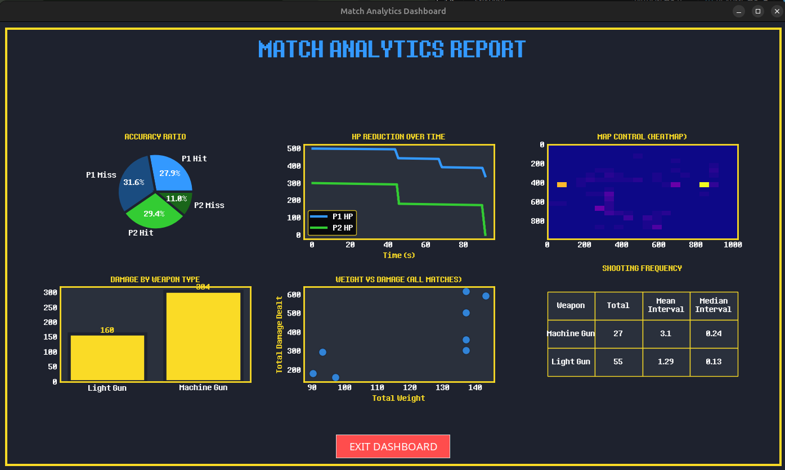
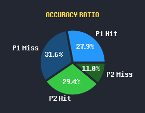
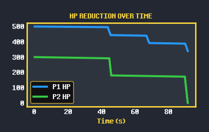
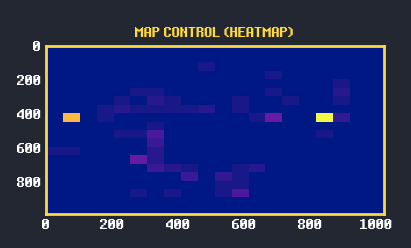
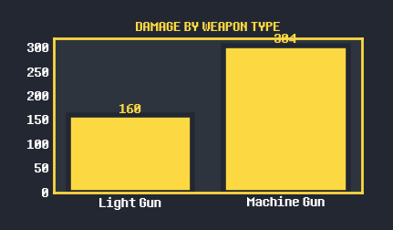
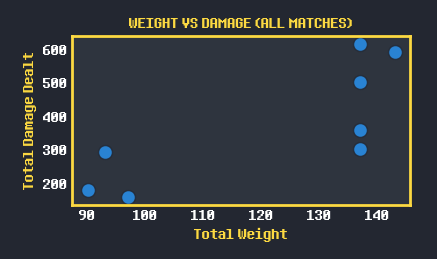
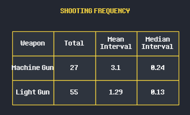

# Data Visualization

This document describes the data visualization page of RoboBash. The dashboard opens in a Tkinter window when the player exits the match and contains six components displayed in a single 2×3 grid. Each component visualizes a different aspect of the match data recorded by the `DataTracker` class.

---

## Overall Dashboard

The full dashboard is presented as a single page titled **"MATCH ANALYTICS REPORT"**. It contains six components arranged in a 2-row × 3-column grid: (top row) Accuracy Pie Chart, HP Reduction Line Graph, Map Control Heatmap; (bottom row) Damage-by-Weapon Bar Chart, Weight-vs-Damage Scatter Plot, and Shooting Frequency Table. The dark theme with yellow highlights matches the in-game aesthetic, and a single **EXIT DASHBOARD** button closes the analytics window. All six components are generated after every match from the `match_log` dictionary and the appended CSV history, so the view always reflects the most recent match plus cumulative build history.

---

## 1. Accuracy Ratio (Pie Chart)

The accuracy pie chart shows the hit/miss split for both players in a single visual. The chart is divided into four wedges — P1 Hit, P1 Miss, P2 Hit, P2 Miss — each colored with the player's team color (blue for P1, green for P2) and a darker shade for misses. Percentages are rendered directly on each wedge. Data comes from every `shots_hit_miss` event logged by `DataTracker`: a projectile that collides with the enemy robot counts as a hit; one that leaves the arena or strikes an obstacle counts as a miss. This view makes it easy to compare both accuracy between players and overall shot volume in one glance. If no shots were fired, the chart displays "NO SHOTS" instead.

---

## 2. HP Reduction Over Time (Line Graph)

This line graph plots each player's remaining HP against elapsed match time (in seconds). P1 is drawn in yellow, P2 in green, with a 3-pixel line width for readability. Data is sourced from the `hp_timeline` dictionary, which `DataTracker` updates whenever a damage event occurs. The x-axis is time (seconds since match start), and the y-axis is HP. The graph makes it easy to see the shape of the match — whether it was a steady trade, a sudden burst of damage near the end, or a one-sided blowout — and the exact moment each player's HP dropped.

---

## 3. Map Control Heatmap (2D Histogram)

The map-control heatmap is a 2D histogram (20×20 bins) overlaid on the arena's coordinate space (1024 × 986). X and Y coordinates from every logged `movement` sample for both players are combined into a single density map, so brighter cells indicate locations where either player spent more time. The `plasma` colormap provides a clear gradient from low to high density, and the Y-axis is inverted to match the in-game top-down orientation. This view is especially useful for identifying positioning habits — which corners players camp in, whether they control the center, and whether the obstacle layout pushed the fight into predictable zones.

---

## 4. Damage by Weapon Type (Bar Chart)

This bar chart totals damage dealt per weapon type across the current match. The x-axis lists weapon names (Machine Gun, Light Gun, Laser Cannon — whichever were used in the match), and the y-axis shows total damage. Each bar is labeled with its exact numeric value directly above the bar for quick reading. Data is aggregated from every `damage` event logged by `DataTracker`, grouped by the weapon field. This view directly answers the question "which weapon actually dealt the most damage?" and helps calibrate expectations — a high-DPS weapon that misses often may underperform a lower-DPS weapon that lands consistently.

---

## 5. Weight vs. Damage Across All Matches (Scatter Plot)

This scatter plot is the only component that uses **historical** data rather than single-match data. Each point represents one player from one completed match, with the x-axis showing total robot weight and the y-axis showing total damage dealt. Data is loaded from `match_logs.csv`, which accumulates across play sessions. The plot lets players spot long-term trends — for example, whether heavy builds reliably deal more damage, whether lightweight builds can compete, or whether a sweet-spot weight range dominates. If no prior match data exists, the panel displays "NO DATA YET" instead.

---

## 6. Shooting Frequency (Statistics Table)

This table summarizes shot-timing statistics per weapon used in the match. It has four columns: **Weapon**, **Total** (number of shots fired), **Mean Interval** (average seconds between consecutive shots), and **Median Interval** (median seconds between consecutive shots). Intervals are computed from the timestamp array stored in `shots_fired`, using Python's built-in `statistics` module for mean and median. The mean-vs-median comparison is informative: a weapon with a much higher mean than median indicates occasional long gaps (idle time), while close values indicate steady sustained fire. If no shots were fired in the match, the table shows a single `["None", 0, 0, 0]` row.